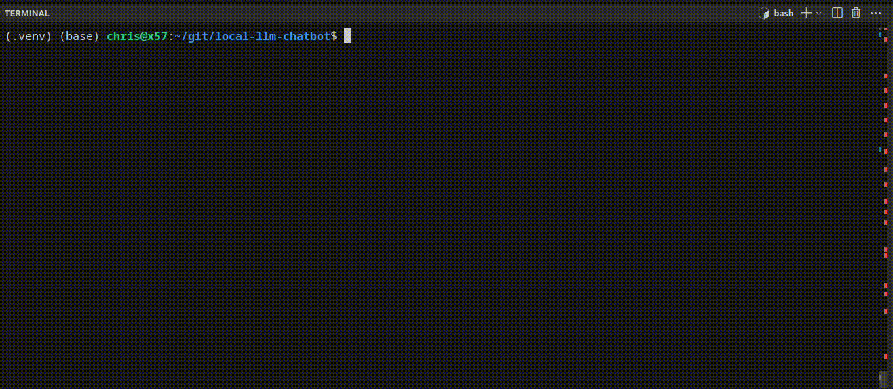

Relevant learning materials
* Intro to building with GenAI using LangChain and Open AI <https://learn.deeplearning.ai/langchain/lesson/1/introduction>
* https://learn.deeplearning.ai/langchain-chat-with-your-data/lesson/1/introduction




## Setup
### 1) Prepare the ollama
Follow the official docs to get setup: <https://github.com/ollama/ollama>

#### Configure your .env file as needed
* Ensure the `MODEL` defined is one you have downloaded with ollama
    * NOTE: The `mistral` model provided by ollama is really `7b-instruct-v0.2-q4_0`. This model is blazing fast, but isn't that smart and will fail on anything but simple questions.
        * This may change in the future as ollama updates their defaults
    * For higher quality outputs, try updating the model to `mixtral`, note this will be slower
* Make sure the URL specified is correct for your setup of Ollama

### 2) Install prereqs
```
python3 -m venv .venv
source .venv/bin/activate
pip install -r requirements.txt --upgrade
```

## Spin up a qdrant vector db 
This is needed for some of the more advanced examples, such as example 3. Example 2 uses qdrant in memory. 

docker run -p 6333:6333 -p 6334:6334 \
    -v $(pwd)/qdrant_storage:/qdrant/storage:z \
    qdrant/qdrant

## Try out the example scripts


LangChain Chain
```
python langchain-chain-ollama.py
```

Llama_Index RAG chatbot over Ben Franklin's writings
```
python llama_index-rag-ollama.py
```

LangChain Agent with Duck Duck Go search api
Note: Chose Duck Duck Go search API because it is the only of the big ones with a keyless API
```
python langchain-agent-ollama.py
```


## Want to contribute? 

Would love to accept some contributions or requests for other examples you'd like to see. I am running all this on my personal hardware and trying to come up with fun and useful examples for myself.
